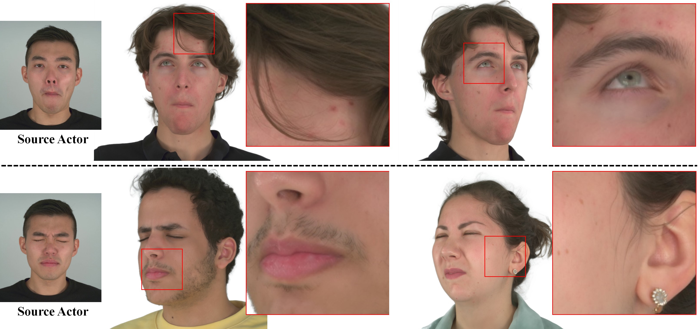

# Gaussian Head Avatar: Ultra High-fidelity Head Avatar via Dynamic Gaussians
## [Paper](https://arxiv.org/abs/2312.03029) | [Project Page](https://yuelangx.github.io/gaussianheadavatar/)
 

## Requirements
### Create the main conda environment.
Download the external libraries.

Save path of project dir for convenience:
```
export PROJECT_DIR=$PWD
mkdir ext
```

Download right version `pytorch3d`:
```
cd $PROJECT_DIR/ext && git clone https://github.com/facebookresearch/pytorch3d
cd $PROJECT_DIR/ext/pytorch3d && git checkout 2f11ddc5ee7d6bd56f2fb6744a16776fab6536f7
```

Download `simple-knn` and `diff-rasterization`:
```
cd $PROJECT_DIR/ext && git clone https://github.com/camenduru/simple-knn
cd $PROJECT_DIR/ext && git clone https://github.com/graphdeco-inria/diff-gaussian-rasterization.git 
cd $PROJECT_DIR/ext/diff-gaussian-rasterization-hair/third_party && git clone https://github.com/g-truc/glm
cd $PROJECT_DIR/ext/diff-gaussian-rasterization-hair/third_party/glm && git checkout 5c46b9c07008ae65cb81ab79cd677ecc1934b903
```
Important: change the `NUM_CHANNELS 3` to `NUM_CHANNELS 32` in `diff-gaussian-rasterization/cuda_rasterizer/config.h`

Download `kaolin` package:
```
cd $PROJECT_DIR/ext && git clone --recursive https://github.com/NVIDIAGameWorks/kaolin
cd $PROJECT_DIR/ext/kaolin && git checkout v0.15.0
```

Install the environment:
```
cd $PROJECT_DIR && conda env create -f environment.yaml
```

Then follow the instruction on [NeRSemble dataset](https://tobias-kirschstein.github.io/nersemble/) to further install `nersemble_data` (Skip if you've already had preprocessed data). 

<!-- * Install [Pytorch3d](https://github.com/facebookresearch/pytorch3d).
```
pip install --no-index --no-cache-dir pytorch3d -f https://dl.fbaipublicfiles.com/pytorch3d/packaging/wheels/py38_cu113_pyt1120/download.html
```
* Install [kaolin](https://github.com/NVIDIAGameWorks/kaolin).
```
pip install kaolin==0.13.0 -f https://nvidia-kaolin.s3.us-east-2.amazonaws.com/torch-1.12.0_cu113.html
```
* Install diff-gaussian-rasterization and simple_knn from [gaussian-splatting](https://github.com/graphdeco-inria/gaussian-splatting). Note, for rendering 32-channel images, please modify "NUM_CHANNELS 3" to "NUM_CHANNELS 32" in "diff-gaussian-rasterization/cuda_rasterizer/config.h".
```
cd path/to/gaussian-splatting
# Modify "submodules/diff-gaussian-rasterization/cuda_rasterizer/config.h"
pip install submodules/diff-gaussian-rasterization
pip install submodules/simple-knn
```
* Download ["tets_data.npz"](https://drive.google.com/file/d/1SMkp8v8bDyYxEdyq25jWnAX1zeQuAkNq/view?usp=drive_link) and put it into "assets/". -->


### Create a conda environment for preprocessing (Skip if you've already had preprocessed data).
We need one more environment(mv-3dmm-fitting) for FLAME fittting. We refer to the method in GHA.

Fit BFM model for head pose and expression coefficients using [Multiview-3DMM-Fitting](https://github.com/YuelangX/Multiview-3DMM-Fitting). Please follow the instructions.


<!-- ## Datasets
We provide instructions for preprocessing [NeRSemble dataset](https://tobias-kirschstein.github.io/nersemble/):
* Apply to download [NeRSemble dataset](https://tobias-kirschstein.github.io/nersemble/) and unzip it into "path/to/raw_NeRSemble/".
* Extract the images, cameras and background for specific identities into a structured dataset "NeRSemble/{id}".
```
cd preprocess
python preprocess_nersemble.py
```
* Remove background using [BackgroundMattingV2](https://github.com/PeterL1n/BackgroundMattingV2). Please git clone the code. Download [pytorch_resnet101.pth](https://drive.google.com/file/d/1zysR-jW6jydA2zkWfevxD1JpQHglKG1_/view?usp=drive_link) and put it into "path/to/BackgroundMattingV2/assets/". Then run the script we provide "preprocess/remove_background_nersemble.py".
```
cp preprocess/remove_background_nersemble.py path/to/BackgroundMattingV2/
cd path/to/BackgroundMattingV2
python remove_background_nersemble.py
```
* Fit BFM model for head pose and expression coefficients using [Multiview-3DMM-Fitting](https://github.com/YuelangX/Multiview-3DMM-Fitting). Please follow the instructions.

We provide a [mini demo dataset](https://drive.google.com/file/d/1OddIml-gJgRQU4YEP-T6USzIQyKSaF7I/view?usp=drive_link) for checking whether the code is runnable. Note, before downloading it, you must first sign the [NeRSemble Terms of Use](https://forms.gle/H4JLdUuehqkBNrBo7). -->


### Checkpoints for preprocessing
Most checkpoints should be placed in `assets` folder. In short, there will be folders:
```
├── BFM
│   └── BFM09_model_info.mat
├── CDGNet
│   └── LIP_epoch_149.pth
├── FLAME
│   ├── FLAME_masks.pkl
│   ├── flame2023.pkl
│   ├── flame_dynamic_embedding.npy
│   ├── flame_static_embedding.pkl
│   ├── generic_model.pkl
│   ├── hair_list.pkl
│   ├── head_template_mesh.obj
│   ├── landmark_embedding_with_eyes.npy
│   ├── tex_mean_painted.png
│   └── uv_masks.npz
├── MODNet
│   └── modnet_photographic_portrait_matting.ckpt
├── flame_mesh_aligned_to_pinscreen.obj
├── perm
│   └── checkpoints
│       ├── stylegan2-raw-texture.pkl
│       ├── unet-superres.pkl
│       └── vae-res-texture.pkl
└── tets_data.npz
```


## Preprocessing(Skip if you've already had preprocessed data)
We have tested two datasets, one renderme and NeRSemble.

### NeRSemble

We prepared `preprocess.sh` that should work well after modifyiny the following varialble:
- `PROJECT_DIR`: Your project dir
- `SUBJECTS`: Array containing target subjects to preproces
- `SEQUENCES`: Array contataining target sequences to preprocess

Or you can preprocess one sequence and one subject step by step. The logic of `preprocess.sh` is as following:

Since we adopt GHA as the base, we use their file structure. For example, inside subject '226', the strcture like:
```
├── calibration
│   ├── camera_params.json
│   └── color_calibration.json
└── sequences
    ├── BACKGROUND
    │   ├── image_220700191.jpg
    │   ├── image_221501007.jpg
    │   ├── ...
    │   ├── image_cameraid.jpg
    ├── EXP-1-head
    │   ├── FLAME_params
    │   ├── NeuralHaircut_masks
    │   ├── background
    │   ├── cameras
    │   ├── images
    │   ├── landmarks
    │   ├── orientation_maps
    │   └── params
    └── HAIR
        ├── FLAME_params
        ├── NeuralHaircut_masks
        ├── background
        ├── cameras
        ├── images
            ├── 0000
                ├── image_220700191.jpg
                ├── image_221501007.jpg
                ├── image_222200036.jpg
                ├── image_222200037.jpg
                ├── ... 
                ├── image_cameraid.jpg
            ├── 0001
            ├── 0002
            ├── 0003
            ├── 0004
            ├── 0005
            ├── ... 
            ├── frame_id
        ├── landmarks
        ├── orientation_maps
        └── params
```

#### Set environment variable

Firstly, set the environment varibale to you corresponding directory.
``` bash
# Your work folder
PROJECT_DIR="/local/home/haonchen/Gaussian-Head-Avatar"
# Input data path, e.g where you gonna put the downloaded NeRSemble data
DATA_ROOT="$PROJECT_DIR/datasets/NeRSemble"

# Target subject and sequence
SUBJECT="258"
SEQUENCE="HAIR"
DATA_PATH="$DATA_ROOT/$SUBJECT/sequences/${SEQUENCE}"
```

Where you specify the sequence and subject of NeRSemble

#### Donwload NeRsemble dataset to your $DATA_ROOT directory 
Please follow the instruction of NeRSemble dataset
``` bash
conda activate gha   
nersemble-data download $DATA_ROOT --participant $SUBJECT --sequence $SEQUENCE 

```

#### Preprocess

1. 
``` bash
cd  $PROJECT_DIR/preprocess
python preprocess_nersemble.py --data_source $DATA_ROOT --data_output $DATA_PATH --id_list $SUBJECT --sequence $SEQUENCE
```

<!-- 2.  Now we have done the GHA preprocessing(some image editing).
After that, run VHAP for FLAME fitting and head mask


``` bash
# Run VHAP tracking 
conda activate VHAP
cd $PROJECT_DIR/ext/VHAP

CUDA_VISIBLE_DEVICES="$GPU" python vhap/preprocess_video.py \
--input ${DATA_ROOT}/${SUBJECT}/sequences/${SEQUENCE}* \
--downsample_scales 2 4 \
--matting_method background_matting_v2

# Align and track faces
CUDA_VISIBLE_DEVICES="$GPU" python vhap/track_nersemble_v2.py --data.root_folder ${DATA_ROOT} \
--exp.output_folder $TRACK_OUTPUT_FOLDER \
--data.subject $SUBJECT --data.sequence $SEQUENCE \
--model.no_use_static_offset --data.n_downsample_rgb 4  

# Export tracking results into a NeRF-style dataset
CUDA_VISIBLE_DEVICES="$GPU" python vhap/export_as_nerf_dataset.py \
--src_folder ${TRACK_OUTPUT_FOLDER} \
--tgt_folder ${EXPORT_OUTPUT_FOLDER} --background-color white

# Convert structure to images | frame_id | image_camera_id.jpg 
cd  $PROJECT_DIR/preprocess
python convert_nersemble.py --data_source ${DATA_ROOT} --intermediate_data ${EXPORT_OUTPUT_FOLDER} --data_output ${DATA_PATH}
``` -->
2. Run hair mask detection

``` bash
# face mask from neural haircut
cd $PROJECT_DIR/preprocess
conda deactivate && conda activate matte_anything
# conda deactivate && conda activate gha2
CUDA_VISIBLE_DEVICES="$GPU" python calc_masks.py \
    --data_path $DATA_PATH --model_dir $PROJECT_DIR/ext/Matte-Anything --img_size 2048\
    --kernel_size 5 \
    --MODNET_ckpt $PROJECT_DIR/assets/MODNet/modnet_photographic_portrait_matting.ckpt \
    --CDGNET_ckpt $PROJECT_DIR/assets/CDGNet/LIP_epoch_149.pth \
    --ext_dir $PROJECT_DIR/ext/
```

3. Run the orientation 

```bash
cd $PROJECT_DIR/preprocess 
conda deactivate && conda activate gha
CUDA_VISIBLE_DEVICES="$GPU" python calc_orientation_maps.py \
    --img_dir $DATA_PATH/images --mask_dir $DATA_PATH/NeuralHaircut_masks/hair --orient_dir $DATA_PATH/orientation_maps \
    --conf_dir $DATA_PATH/orientation_confidence_maps --filtered_img_dir $DATA_PATH/orientation_filtered_imgs --vis_img_dir $DATA_PATH/orientation_vis_imgs

```

4. Run GHA FLAME fitting
``` bash
# # landmark detection and FLAME fitting
cd $PROJECT_DIR/preprocess
conda deactivate && conda activate mv-3dmm-fitting
CUDA_VISIBLE_DEVICES="$GPU" python detect_landmarks.py \
    --image_folder $DATA_PATH/images --landmark_folder $DATA_PATH/landmarks --image_size 2048
CUDA_VISIBLE_DEVICES="$GPU" python fitting.py \
    --config $PROJECT_DIR/config/FLAME_fitting_NeRSemble_031.yaml \
    --image_folder $DATA_PATH/images --landmark_folder $DATA_PATH/landmarks \
    --param_folder $DATA_PATH/FLAME_params --camera_folder $DATA_PATH/cameras --image_size 2048
    
CUDA_VISIBLE_DEVICES="$GPU" python fitting.py \
    --config $PROJECT_DIR/config/BFM_fitting_NeRSemble_031.yaml \
    --image_folder $DATA_PATH/images --landmark_folder $DATA_PATH/landmarks \
    --param_folder $DATA_PATH/params --camera_folder $DATA_PATH/cameras --image_size 2048
```
<!-- ps: Apparently some data can be reused from previous step, but for simplicity(and less bugy), just use the original commands from GHA.
 -->


## Training
First, edit the config file, for example "config/train_meshhead_N226", and train the geometry guidance model.
```
python train_meshhead.py --config config/train_meshhead_N226.yaml
```
Second, edit the config file "config/train_gaussianhead_N226", and train the gaussian head avatar.
```
python train_gaussianhead.py --config config/train_gaussianhead_N226.yaml
```


## Load Checkpoint(for training or reenactment)
All related parameters are in corresponding config, e.g.  `config/train_gaussianhead_hair_N226.yaml`.
```
# toggle the checkpoint loading
resume_training: True
...
save_freq: 10000
```
There are two ways to specify the checkpoint path

### Load by unique number
For each run, the project will save the latest checkpoints with a unique number, such as `checkpoints/gaussianhead_NeRSemble226/gaussianhair_latest_175769288250`.
You can find the number in the terminal output. 
Specify it in the config and the program shall try to find the checkpoints for both head and hair models when `resume_training` is on. 
```
checkpoint_seed: 175585577969 
```

### Load by path(It will override the 'load by unique number'.)
You may also directly specify the path to load in config.
```
gaussianheadmodule:
    load_gaussianhead_checkpoint: 'checkpoints/gaussianhead_hair_renderme_StaticInit/gaussianhead_iter_20000'
gaussianhairmodule
    load_gaussianhair_checkpoint: 'checkpoints/gaussianhead_hair_renderme_StaticInit/gaussianhair_iter_20000' 
```


## Reenactment
Once the two-stage training is completed, the trained avatar can be reenacted by a sequence of expression coefficients. Please specify the avatar checkpoints and the source data in the config file "config/reenactment_N031.py" and run the reenactment application.
```
python reenactment.py --config config/train_gaussianhead_N226.yaml
```


## Acknowledgement
Part of the code is borrowed from [gaussian-splatting](https://github.com/graphdeco-inria/gaussian-splatting).

## Citation
```
@inproceedings{xu2023gaussianheadavatar,
  title={Gaussian Head Avatar: Ultra High-fidelity Head Avatar via Dynamic Gaussians},
  author={Xu, Yuelang and Chen, Benwang and Li, Zhe and Zhang, Hongwen and Wang, Lizhen and Zheng, Zerong and Liu, Yebin},
  booktitle={Proceedings of the IEEE/CVF Conference on Computer Vision and Pattern Recognition (CVPR)},
  year={2024}
}
